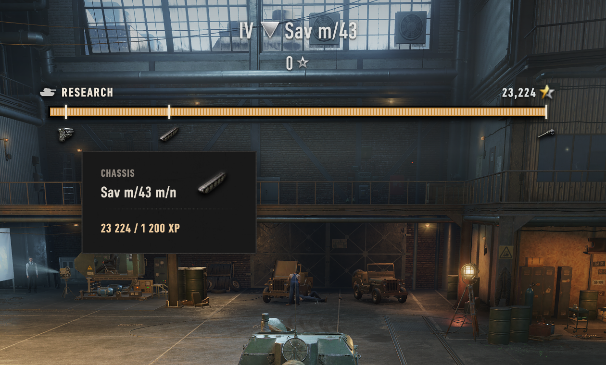
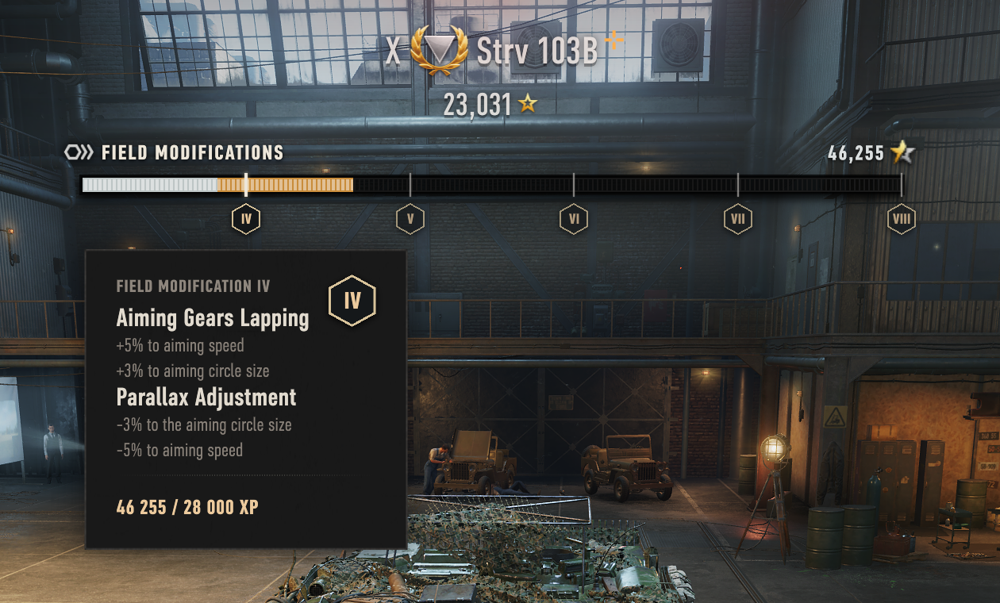
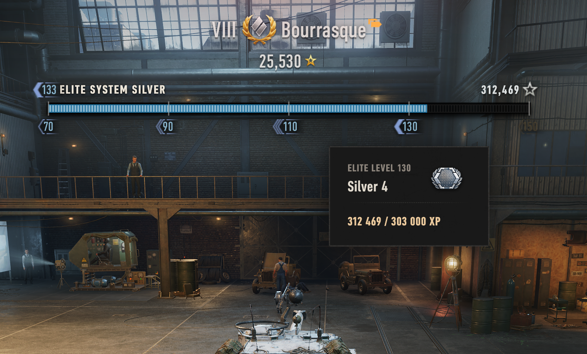
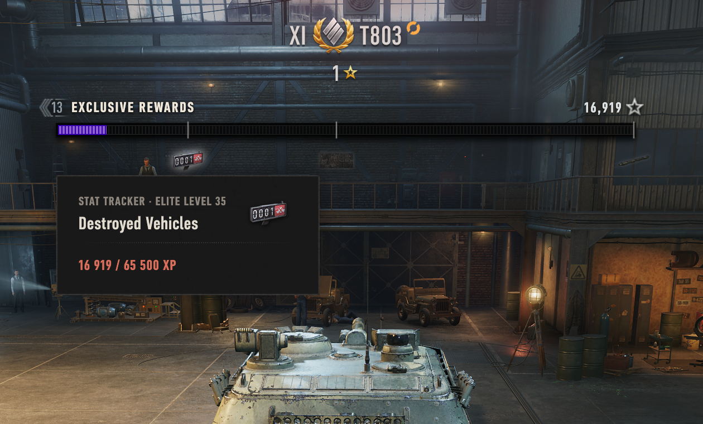
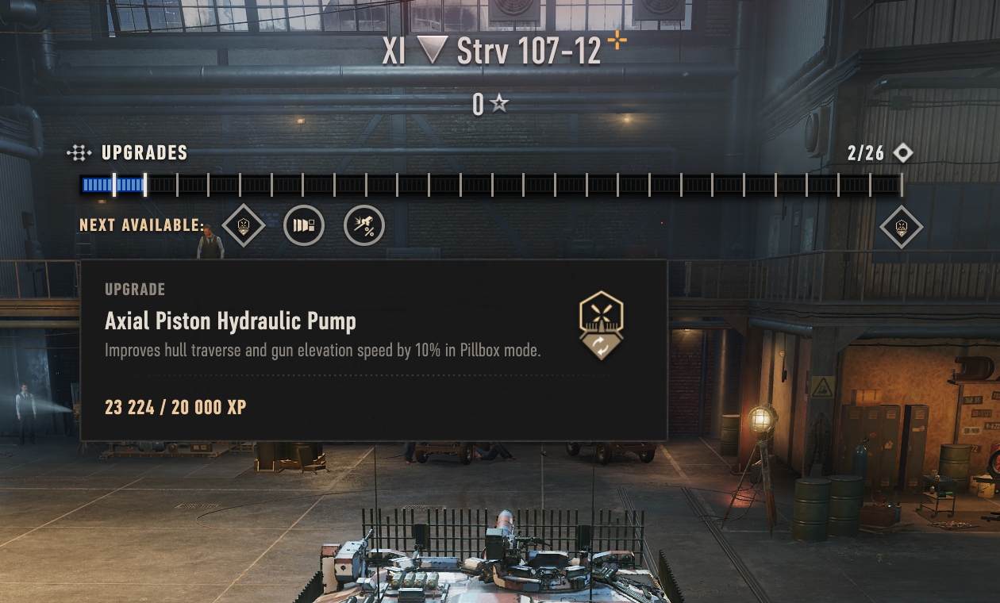

# Garage Progress Bar — World of Tanks mod

A Garage progress bar for the vehicle you have selected. It shows the vehicle's
**tech-tree research, Field Modifications, Elite Levels (prestige), and Tier XI
upgrades** using the game's own icons, ticks, and tooltips, styled to match the
stock progress bars. It updates live as you switch vehicles or earn XP.

**English** · [Українська](#garage-progress-bar--українська)

## What it shows

- **Tech-tree research** — researched modules and the next vehicle to unlock.
- **Field Modifications** — the post-progression upgrade ladder.
- **Elite Levels (prestige)** — the current grade-band progression once a vehicle is elite.
- **Tier XI exclusive rewards** — the milestone reward roadmap earned on Tier XI vehicles.
- **Tier XI skill tree** — how many skill-tree upgrades you've unlocked out of the total.

**Click the bar** to research modules, unlock the next vehicle, or apply Tier XI
upgrades without leaving the Garage. **Hover** any tick or icon for a tooltip.

### Every progression type

**Field Modifications** — the post-progression upgrade ladder:

**Elite Levels (prestige)** — the current grade-band progression:

**Tier XI exclusive rewards** — the milestone reward roadmap:

**Tier XI skill tree** — skill-tree upgrades unlocked out of the total on a Tier XI vehicle:

## Compatibility

| Requirement | Detail |
|-------------|--------|
| **Game** | World of Tanks **EU 2.3.0.1** (Wargaming global client). Built and tested against this version. |
| **Required** | **OpenWG GameFace** 1.1.6+ — install it first, or the bar will not appear. From [wgmods.net](https://wgmods.net) or [gitlab.com/openwg/wot.gameface](https://gitlab.com/openwg/wot.gameface). |
| **Optional** | **ModsSettingsAPI** 1.7.0+ — adds the in-game settings panel. Without it the bar simply shows everywhere with no toggles. Most modpacks already include it. |

## Download & install

**Easiest — the one-click installer (Windows).** Download the latest
**`GarageProgressBar-Setup-<version>.exe`** from the
[**GitHub Releases**](https://github.com/drizzer14/garage-research-progress/releases)
page and run it (close the game first). It finds your World of Tanks folder, installs
the mod into `mods\<version>\`, and adds **OpenWG GameFace** and **ModsSettingsAPI**
if you don't already have them.

**Manual installation.** Grab
`com.14th_ua.garageprogressbar_<version>.wotmod` from the same Releases page and
follow **[`INSTALL.md`](./INSTALL.md)** — it covers the manual copy, verifying it
works, troubleshooting, and uninstalling.

## Settings

With **ModsSettingsAPI** installed, the mod's options appear in the **Modification
list** window that ModsSettingsAPI adds — there you can hide the bar completely, or
hide it only on fully-progressed vehicles. Without ModsSettingsAPI the bar simply
shows everywhere with no options.

## Notes & limitations

- **Event / special-mode hangars** (for example 7×7) don't expose the panel the bar
  attaches to, so it won't show there. It returns in the normal Garage.
- **After a game update**, move the `.wotmod` to the new `mods\<version>\` folder. A
  new client version may need a rebuilt mod — check the Releases page.

## Modpacks & license

Free to use, redistribute, and include in modpacks as long as it stays free and
credits the author (**14th_ua**) with a link back to this repository — see
[`LICENSE.md`](./LICENSE.md). For modpacks, add only the `.wotmod` and list OpenWG
GameFace as a required dependency; don't bundle GameFace or ModsSettingsAPI yourself.

## Contributing / developers

Building, deploying, testing, and the repo layout are documented in
[`CONTRIBUTING.md`](./CONTRIBUTING.md) (and the dev loop in
[`tools/dev/README.md`](./tools/dev/README.md)).

---

# Garage Progress Bar — Українська

Смуга прогресу в Ангарі для обраної техніки. Показує **дослідження в дереві
розвитку, Польові модифікації, Елітні рівні (престиж) та вдосконалення XI рівня**
рідними ігровими іконками, позначками й підказками у стилі стандартних смуг
прогресу. Оновлюється в реальному часі, коли ви змінюєте техніку або отримуєте досвід.

[English](#garage-progress-bar--world-of-tanks-mod) · **Українська**

## Що показує

- **Дослідження в дереві розвитку** — досліджені модулі та наступна техніка для відкриття.
- **Польові модифікації** — рівні вдосконалень після завершення прокачування.
- **Елітні рівні (престиж)** — поточний прогрес за грейдами після досягнення елітності.
- **Ексклюзивні нагороди XI рівня** — дорожня карта нагород для техніки XI рівня.
- **Дерево навичок XI рівня** — скільки вдосконалень дерева навичок відкрито із загальної кількості.

**Натисніть на смугу**, щоб досліджувати модулі, відкрити наступну техніку або
застосувати вдосконалення XI рівня прямо з Ангара. **Наведіть** курсор на позначку
чи іконку, щоб побачити підказку.

## Сумісність

| Вимога | Деталі |
|--------|--------|
| **Гра** | World of Tanks **EU 2.3.0.1** (глобальний клієнт Wargaming). Зібрано й перевірено для цієї версії. |
| **Обов'язково** | **OpenWG GameFace** 1.1.6+ — встановіть першим, інакше смуга не з'явиться. З [wgmods.net](https://wgmods.net) або [gitlab.com/openwg/wot.gameface](https://gitlab.com/openwg/wot.gameface). |
| **Необов'язково** | **ModsSettingsAPI** 1.7.0+ — додає панель налаштувань у грі. Без неї смуга просто показується скрізь без перемикачів. Більшість модпаків уже містять її. |

## Завантаження та встановлення

**Найпростіше — інсталятор в один клік (Windows).** Завантажте найновіший
**`GarageProgressBar-Setup-<version>.exe`** зі сторінки
[**релізів на GitHub**](https://github.com/drizzer14/garage-research-progress/releases)
і запустіть (спершу закрийте гру). Він знаходить папку World of Tanks, встановлює мод
у `mods\<version>\` і додає **OpenWG GameFace** та **ModsSettingsAPI**, якщо їх ще немає.

**Встановлення вручну.** Візьміть `com.14th_ua.garageprogressbar_<version>.wotmod` з
тієї ж сторінки релізів і дотримуйтесь **[`INSTALL.md`](./INSTALL.md)** — там описано
ручне копіювання, перевірку роботи, усунення несправностей і видалення.

## Налаштування

Зі встановленим **ModsSettingsAPI** параметри мода з'являються у вікні **Список
модифікацій**, яке додає ModsSettingsAPI — там можна повністю приховати смугу або
ховати її лише на повністю прокачаній техніці. Без ModsSettingsAPI смуга просто
показується скрізь без параметрів.

## Примітки та обмеження

- **Подієві та спеціальні ангари** (наприклад 7×7) не надають панель, до якої
  кріпиться смуга, тож там вона не з'явиться. У звичайному Ангарі вона повертається.
- **Після оновлення гри** перемістіть `.wotmod` у нову папку `mods\<версія>\`. Нова
  версія клієнта може потребувати перезібраного мода — перевіряйте сторінку релізів.

## Модпаки та ліцензія

Вільно використовувати, поширювати та включати в модпаки, доки це залишається
безкоштовним і зазначає автора (**14th_ua**) з посиланням на цей репозиторій — див.
[`LICENSE.md`](./LICENSE.md). Для модпаків додавайте лише `.wotmod` і вкажіть OpenWG
GameFace як обов'язкову залежність; не вкладайте GameFace чи ModsSettingsAPI самі.

## Розробка

Збірка, розгортання, тести та структура репозиторію описані в
[`CONTRIBUTING.md`](./CONTRIBUTING.md) (а цикл розробки — у
[`tools/dev/README.md`](./tools/dev/README.md)).
