# Garage Progress Bar — World of Tanks mod

A Garage progress bar for the vehicle you have selected. It shows the vehicle's
**tech-tree research, Field Modifications, Elite Levels (prestige), and Tier XI
upgrades** using the game's own icons, ticks, and tooltips, styled to match the
stock progress bars. It updates live as you switch vehicles or earn XP.

**English** · [Українська](#garage-progress-bar--українська)

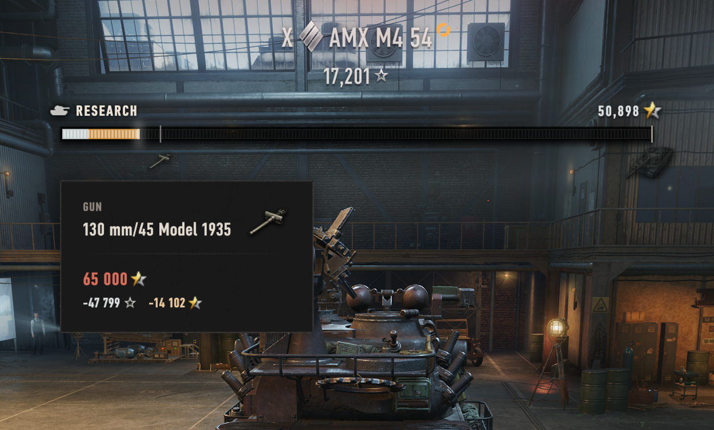

## What it shows

- **Tech-tree research** — researched modules and the next vehicle to unlock.
- **Field Modifications** — the post-progression upgrade ladder.
- **Elite Levels (prestige)** — the current grade-band progression once a vehicle is elite.
- **Tier XI exclusive rewards** — the milestone reward roadmap earned on Tier XI vehicles.
- **Tier XI skill tree** — how many skill-tree upgrades you've unlocked out of the total.
- **Potential Tier XI** — an opt-in projection on Tier X vehicles that have no Tier XI of their own, measuring your banked XP against the Tier XI unlock cost.

**Click the bar** to research modules, unlock the next vehicle, or apply Tier XI
upgrades without leaving the Garage. **Hover** any tick or icon for a tooltip.

### Every progression type

**Field Modifications** — the post-progression upgrade ladder:

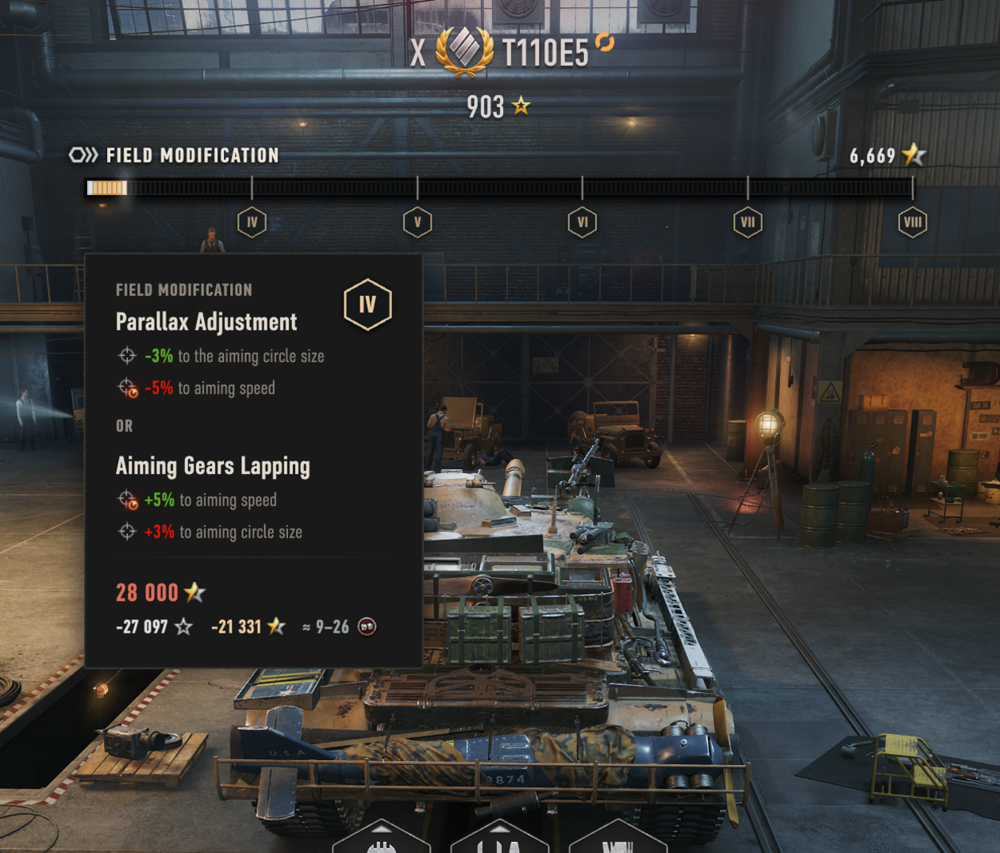

**Elite Levels (prestige)** — the current grade-band progression:

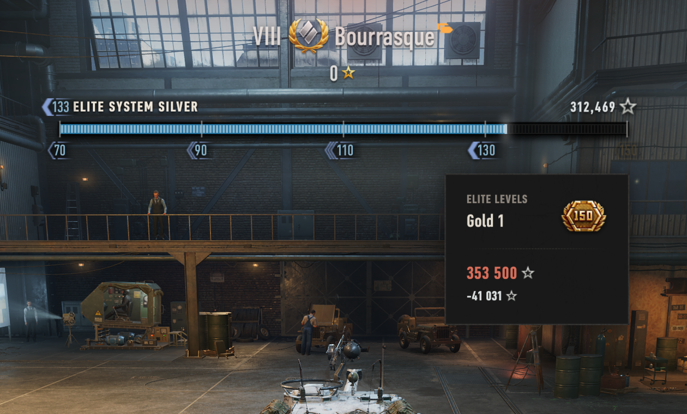

**Tier XI exclusive rewards** — the milestone reward roadmap:

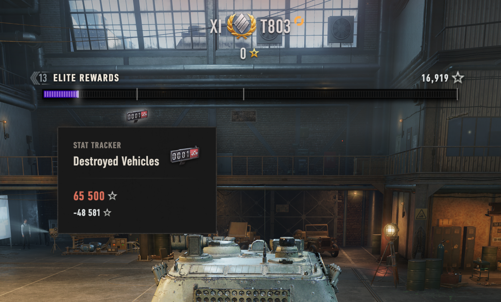

**Tier XI skill tree** — skill-tree upgrades unlocked out of the total on a Tier XI vehicle:

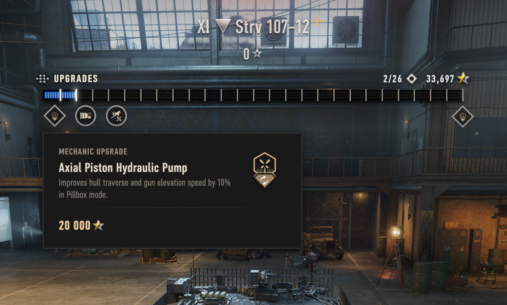

**Potential Tier XI** — an opt-in projection for Tier X vehicles with no Tier XI, measuring banked XP against the unlock cost (off by default):

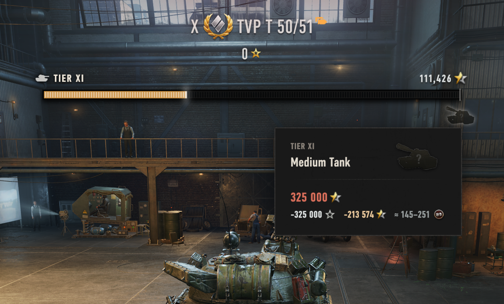

## Compatibility

| Requirement | Detail |
|-------------|--------|
| **Game** | World of Tanks **EU 2.3.1.0** (Wargaming global client). Built and tested against this version. |
| **Required** | **OpenWG GameFace** 1.1.6+ — install it first, or the bar will not appear. From [wgmods.net](https://wgmods.net) or [gitlab.com/openwg/wot.gameface](https://gitlab.com/openwg/wot.gameface). |
| **Optional** | **ModsSettingsAPI** + **ModsList** — add the mod's options to the in-game "Modification list" window. The installer bundles both; without them the bar simply shows everywhere with no toggles. Most modpacks already include them. |

## Download & install

**Easiest — the one-click installer (Windows).** Download the latest
**`GarageProgressBar-Setup-<version>.exe`** from the
[**GitHub Releases**](https://github.com/drizzer14/garage-research-progress/releases)
page and run it (close the game first). It finds your World of Tanks folder, installs
the mod into `mods\<version>\`, and adds **OpenWG GameFace**, **ModsSettingsAPI** and
**ModsList** if you don't already have them. On each run it also checks GitHub and offers to
fetch the newest installer, so a copy you keep around stays current.

**Manual installation.** Grab
`com.14th_ua.garageprogressbar_<version>.wotmod` from the same Releases page and
follow **[`INSTALL.md`](./INSTALL.md)** — it covers the manual copy, verifying it
works, troubleshooting, and uninstalling.

## Settings

With **ModsSettingsAPI** installed, the mod's options appear in the **Modification
list** window that ModsSettingsAPI adds. Without it the bar simply shows everywhere
with the defaults and no options. The controls, in panel order:

- **Show Progress Bar** — the master switch (on by default). Uncheck to hide the bar on
  every vehicle. The six per-mode toggles below and **Fully Progressed** are its
  children, and grey out while it's off.
  - **Research**, **Field Modifications**, **Tier XI**, **Upgrades**, **Elite Rewards**,
    **Elite System** — one checkbox per bar mode (all on by default except **Tier XI**,
    the opt-in Potential Tier XI projection). Unchecking one hides the bar on any vehicle
    that resolves to that mode.
  - **Fully Progressed** — on by default; keeps the bar on vehicles with nothing left to
    research, upgrade, or unlock. Uncheck to hide it once a vehicle is fully progressed.
- **Ignore Free XP** — off by default; counts only the combat XP you earn on each vehicle
  toward its progress, dropping account-wide Free XP from the bar, totals, and tooltips.
- **Scale** (Default / Large) — Large roughly doubles the bar's width and enlarges its
  text, icons, and tooltip.
- **Progress Mode** (Current, or Current / Required) — sets what the XP readout shows: just
  the XP you have so far, or how much you have out of how much the bar needs.
- **Show Progress %** — off by default; prepends a progress percentage to the XP readout.
- **Bar position** — Ctrl+drag the bar in the Garage to move it, or type exact on-screen
  pixel coordinates (**Horizontal (center X)** / **Vertical (top Y)**). The panel's
  per-mod reset returns it to the automatic default.

## Notes & limitations

- **Event / special-mode hangars** (for example 7×7) don't expose the panel the bar
  attaches to, so it won't show there. It returns in the normal Garage.
- **Reposition the bar** by holding **Ctrl** and dragging it in the Garage, or set exact
  pixel coordinates in the settings panel; the panel's per-mod reset returns it to auto.
- **After a game update**, move the `.wotmod` to the new `mods\<version>\` folder. A
  new client version may need a rebuilt mod — check the Releases page.

## Conflicts with mods

- **"Old UI" / legacy-hangar mods** — e.g. *Legacy Interface UI*
  (`renovo.legacyhangar`). These replace the current Garage with the pre-2.0
  interface. The bar is built around the current Garage UI — it attaches to that UI's
  panels and is styled to match its native progress bars — so it won't appear while an
  old-style hangar is active. Switch back to the standard Garage interface to see it.

## Modpacks & license

Free to use, redistribute, and include in modpacks as long as it stays free and
credits the author (**14th_ua**) with a link back to this repository — see
[`LICENSE.md`](./LICENSE.md). For modpacks, add only the `.wotmod` and list OpenWG
GameFace as a required dependency; don't bundle GameFace or ModsSettingsAPI yourself.

## Contributing / developers

Building, deploying, testing, and the repo layout are documented in
[`CONTRIBUTING.md`](./CONTRIBUTING.md) (and the dev loop in
[`tools/dev/README.md`](./tools/dev/README.md)).

---

# Garage Progress Bar — Українська

Смуга прогресу в Ангарі для обраної техніки. Показує **дослідження в дереві
розвитку, Польові модифікації, Елітні рівні (престиж) та вдосконалення XI рівня**
рідними ігровими іконками, позначками й підказками у стилі стандартних смуг
прогресу. Оновлюється в реальному часі, коли ви змінюєте техніку або отримуєте досвід.

[English](#garage-progress-bar--world-of-tanks-mod) · **Українська**

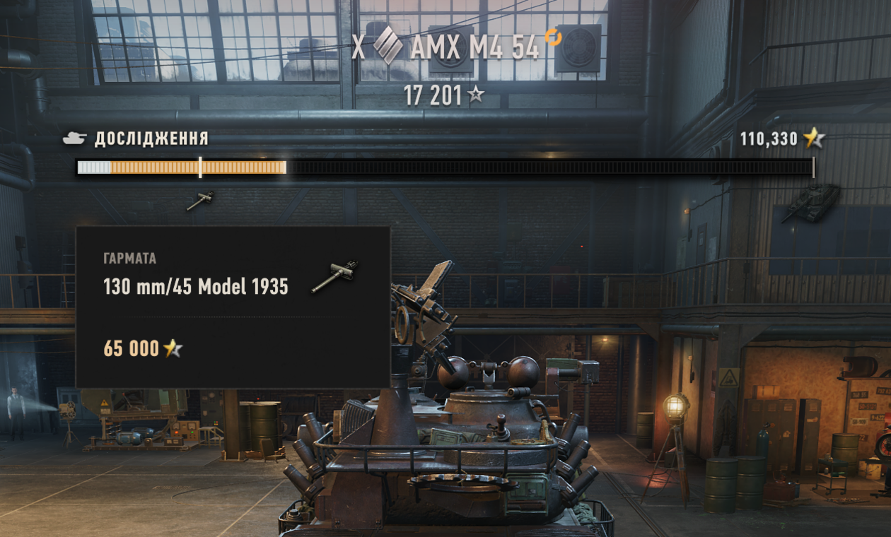

## Що показує

- **Дослідження в дереві розвитку** — досліджені модулі та наступна техніка для відкриття.
- **Польові модифікації** — рівні вдосконалень після завершення прокачування.
- **Елітні рівні (престиж)** — поточний прогрес за грейдами після досягнення елітності.
- **Ексклюзивні нагороди XI рівня** — дорожня карта нагород для техніки XI рівня.
- **Дерево навичок XI рівня** — скільки вдосконалень дерева навичок відкрито із загальної кількості.
- **Потенційний XI рівень** — опційна проекція для техніки X рівня, яка не має власного XI рівня: показує накопичений досвід відносно вартості відкриття XI рівня.

**Натисніть на смугу**, щоб досліджувати модулі, відкрити наступну техніку або
застосувати вдосконалення XI рівня прямо з Ангара. **Наведіть** курсор на позначку
чи іконку, щоб побачити підказку.

### Кожен тип прогресу

**Польові модифікації** — рівні вдосконалень після завершення прокачування:

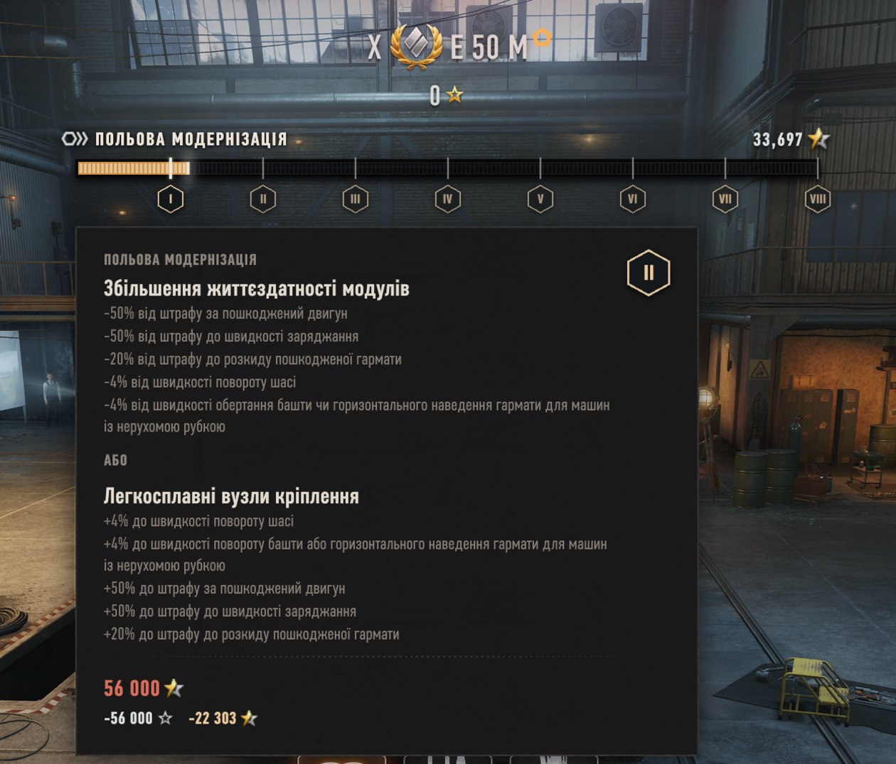

**Елітні рівні (престиж)** — поточний прогрес за грейдами:

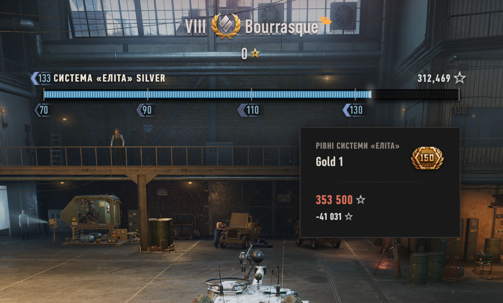

**Ексклюзивні нагороди XI рівня** — дорожня карта нагород:

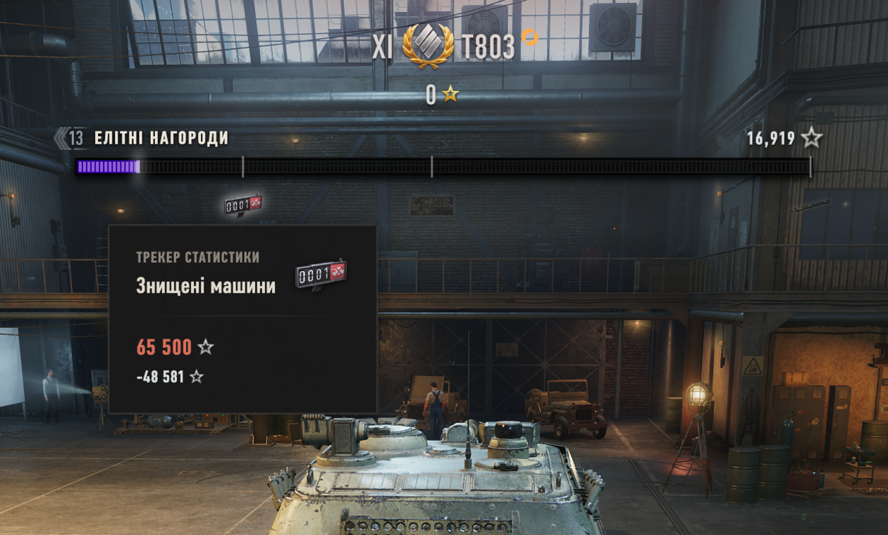

**Дерево навичок XI рівня** — відкриті вдосконалення із загальної кількості на техніці XI рівня:

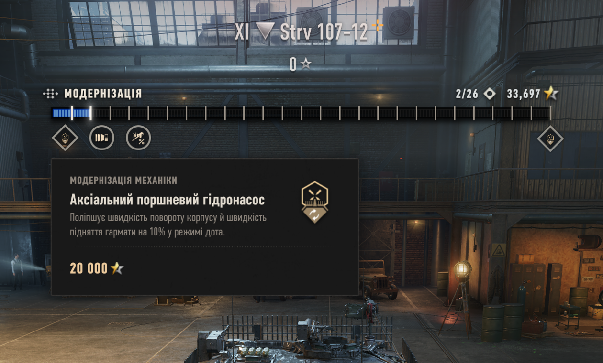

**Потенційний XI рівень** — опційна проекція для техніки X рівня без XI рівня: накопичений досвід відносно вартості відкриття (вимкнено за замовчуванням):

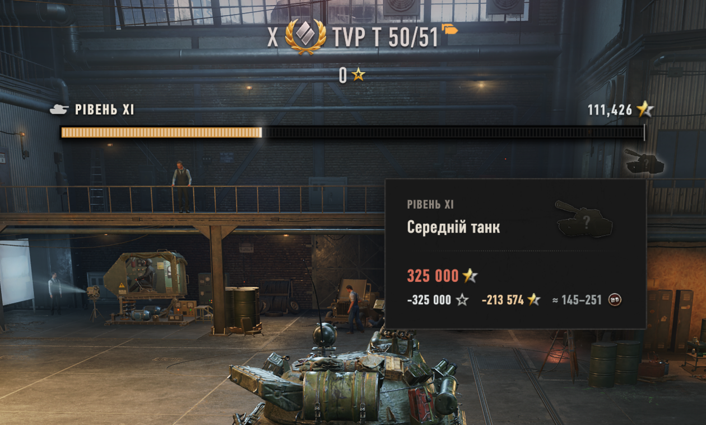

## Сумісність

| Вимога | Деталі |
|--------|--------|
| **Гра** | World of Tanks **EU 2.3.1.0** (глобальний клієнт Wargaming). Зібрано й перевірено для цієї версії. |
| **Обов'язково** | **OpenWG GameFace** 1.1.6+ — встановіть першим, інакше смуга не з'явиться. З [wgmods.net](https://wgmods.net) або [gitlab.com/openwg/wot.gameface](https://gitlab.com/openwg/wot.gameface). |
| **Необов'язково** | **ModsSettingsAPI** + **ModsList** — додають параметри мода у вікно «Список модифікацій» у грі. Інсталятор містить обидва; без них смуга просто показується скрізь без перемикачів. Більшість модпаків уже містять їх. |

## Завантаження та встановлення

**Найпростіше — інсталятор в один клік (Windows).** Завантажте найновіший
**`GarageProgressBar-Setup-<version>.exe`** зі сторінки
[**релізів на GitHub**](https://github.com/drizzer14/garage-research-progress/releases)
і запустіть (спершу закрийте гру). Він знаходить папку World of Tanks, встановлює мод
у `mods\<version>\` і додає **OpenWG GameFace**, **ModsSettingsAPI** та **ModsList**,
якщо їх ще немає. Під час кожного запуску він також перевіряє GitHub і пропонує завантажити
найновіший інсталятор, тож збережена копія залишається актуальною.

**Встановлення вручну.** Візьміть `com.14th_ua.garageprogressbar_<version>.wotmod` з
тієї ж сторінки релізів і дотримуйтесь **[`INSTALL.md`](./INSTALL.md)** — там описано
ручне копіювання, перевірку роботи, усунення несправностей і видалення.

## Налаштування

Зі встановленим **ModsSettingsAPI** параметри мода з'являються у вікні **Список
модифікацій**, яке додає ModsSettingsAPI. Без нього смуга просто показується скрізь зі
значеннями за замовчуванням і без параметрів. Параметри в порядку панелі:

- **Показувати смугу прогресу** — головний перемикач (увімкнено за замовчуванням).
  Зніміть позначку, щоб приховати смугу на всій техніці. Шість перемикачів режимів нижче
  та **Повністю пройдено** є його дочірніми й стають неактивними, коли він вимкнений.
  - **Дослідження**, **Польові модифікації**, **XI рівень**, **Вдосконалення**,
    **Елітні нагороди**, **Елітна система** — по одній позначці на кожен режим смуги
    (усі увімкнені за замовчуванням, крім **XI рівня** — це опційна проекція
    Потенційного XI рівня). Зняття позначки приховує смугу на будь-якій техніці, яка
    відповідає цьому режиму.
  - **Повністю пройдено** — увімкнено за замовчуванням; лишає смугу на техніці, де вже
    нічого досліджувати, вдосконалювати чи відкривати. Зніміть позначку, щоб ховати її
    після повного проходження.
- **Ігнорувати вільний досвід** — вимкнено за замовчуванням; враховує лише бойовий
  досвід, зароблений на кожній техніці, виключаючи загальний вільний досвід зі смуги,
  підсумків і підказок.
- **Масштаб** (За замовчуванням / Великий) — «Великий» приблизно вдвічі збільшує ширину
  смуги та збільшує її текст, іконки й підказку.
- **Режим прогресу** (Поточний, або Поточний / Потрібно) — визначає, що показує лічильник
  досвіду: лише наявний досвід чи скільки є з потрібного.
- **Показувати прогрес у %** — вимкнено за замовчуванням; додає відсоток прогресу перед
  лічильником досвіду.
- **Розташування смуги** — Ctrl+перетягніть смугу в Ангарі, щоб перемістити її, або
  введіть точні екранні координати в пікселях (**По горизонталі (центр X)** /
  **По вертикалі (верх Y)**). Скидання мода в панелі повертає її в автоматичне положення.

## Примітки та обмеження

- **Подієві та спеціальні ангари** (наприклад 7×7) не надають панель, до якої
  кріпиться смуга, тож там вона не з'явиться. У звичайному Ангарі вона повертається.
- **Перемістити смугу** можна, утримуючи **Ctrl** і перетягуючи її в Ангарі, або задавши
  точні координати в пікселях у панелі налаштувань; скидання мода в панелі повертає її в
  автоматичне положення.
- **Після оновлення гри** перемістіть `.wotmod` у нову папку `mods\<версія>\`. Нова
  версія клієнта може потребувати перезібраного мода — перевіряйте сторінку релізів.

## Конфлікти з модами

- **Моди «старого інтерфейсу» / застарілого ангара** — наприклад *Legacy Interface UI*
  (`renovo.legacyhangar`). Вони замінюють сучасний Ангар інтерфейсом до версії 2.0.
  Смуга побудована навколо сучасного інтерфейсу Ангара — кріпиться до його панелей і
  оформлена під його рідні смуги прогресу — тож вона не з'явиться, поки активний ангар
  старого стилю. Поверніться до стандартного інтерфейсу Ангара, щоб її побачити.

## Модпаки та ліцензія

Вільно використовувати, поширювати та включати в модпаки, доки це залишається
безкоштовним і зазначає автора (**14th_ua**) з посиланням на цей репозиторій — див.
[`LICENSE.md`](./LICENSE.md). Для модпаків додавайте лише `.wotmod` і вкажіть OpenWG
GameFace як обов'язкову залежність; не вкладайте GameFace чи ModsSettingsAPI самі.

## Розробка

Збірка, розгортання, тести та структура репозиторію описані в
[`CONTRIBUTING.md`](./CONTRIBUTING.md) (а цикл розробки — у
[`tools/dev/README.md`](./tools/dev/README.md)).
