# Garage Progress Bar — World of Tanks mod

A Garage progress bar for the vehicle you have selected. It shows the vehicle's
**tech-tree research, Field Modifications, Elite Levels (prestige), and Tier XI
upgrades** using the game's own icons, ticks, and tooltips, styled to match the
stock progress bars. It updates live as you switch vehicles or earn XP.

**English** · [Українська](#garage-progress-bar--українська)

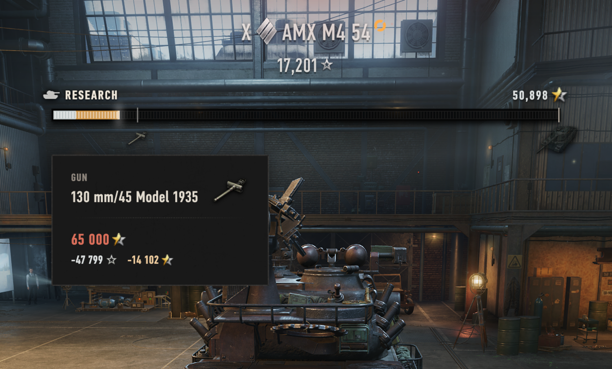

## What it shows

- **Tech-tree research** — researched modules and the next vehicle to unlock.
- **Field Modifications** — the post-progression upgrade ladder.
- **Elite Levels (prestige)** — the current grade-band progression once a vehicle is elite.
- **Tier XI exclusive rewards** — the milestone reward roadmap earned on Tier XI vehicles.
- **Tier XI skill tree** — how many skill-tree upgrades you've unlocked out of the total, plus the next locked upgrades one step ahead, connected to the unlocked skill they build on.
- **Potential Tier XI** — an opt-in projection on Tier X vehicles that have no Tier XI of their own, measuring your banked XP against the Tier XI unlock cost.
- **Fully Progressed** — a golden bar once nothing is left to research, upgrade, or unlock, listing every finished progression type with its total XP cost. Each type's tooltip itemizes what was completed and what each item cost: the researched items, every Field Modification level, the skill tree's final upgrade, and each exclusive reward with the level it unlocks at. On Tier XI vehicles the header carries the same unlocked/total skill counter the Tier XI skill tree bar shows.

**Click the bar** to research modules, unlock the next vehicle, or apply Tier XI
upgrades without leaving the Garage. **Hover** any tick or icon for a tooltip.

### Every progression type

**Field Modifications** — the post-progression upgrade ladder:

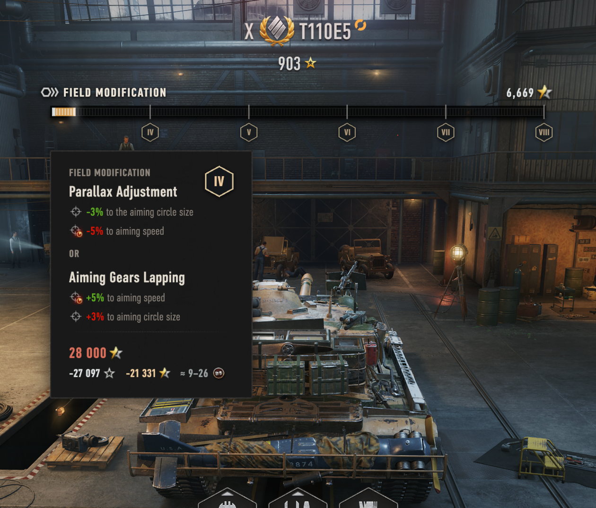

**Elite Levels (prestige)** — the current grade-band progression:

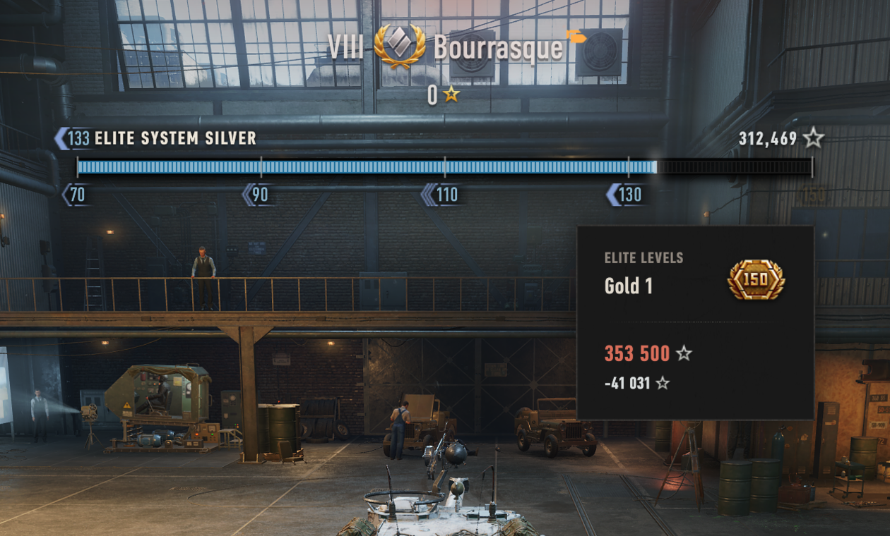

**Tier XI exclusive rewards** — the milestone reward roadmap:

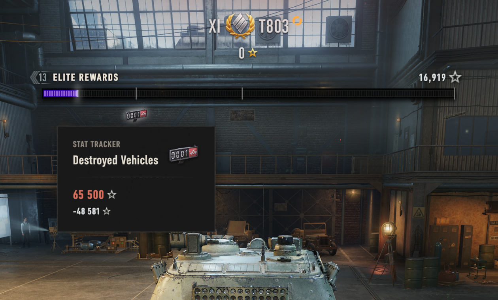

**Tier XI skill tree** — skill-tree upgrades unlocked out of the total on a Tier XI vehicle, with the next locked upgrades shown ahead and linked to the unlocked skill they build on:

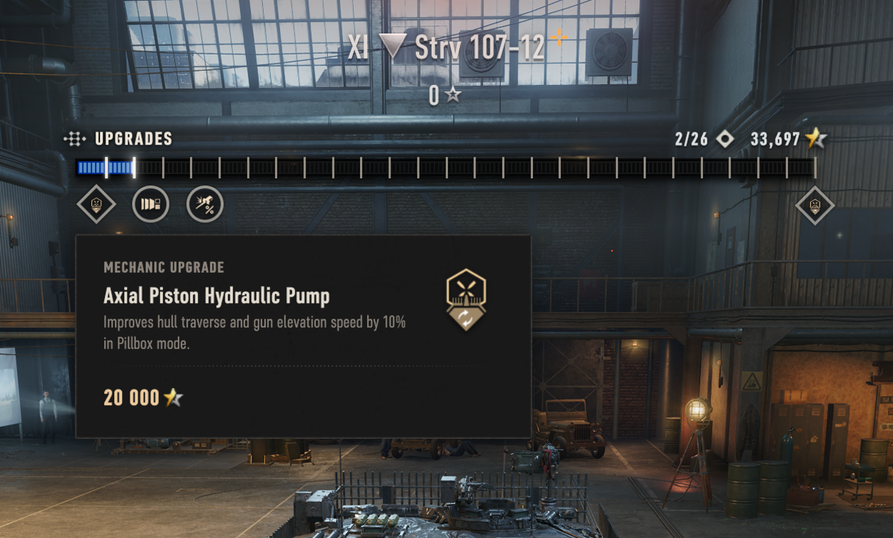

**Potential Tier XI** — an opt-in projection for Tier X vehicles with no Tier XI, measuring banked XP against the unlock cost (off by default):

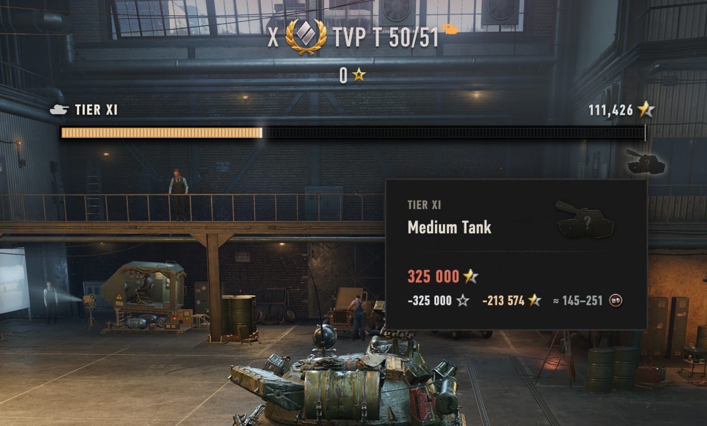

**Fully Progressed** — a golden bar once nothing is left to research, upgrade, or unlock, listing every finished progression type with its total XP cost:

## Compatibility

| Requirement | Detail |
|-------------|--------|
| **Game** | World of Tanks **EU 2.4.0.2** (Wargaming global client). Built and tested against this version. |
| **Required** | **OpenWG GameFace** 1.1.6+ — install it first, or the bar will not appear. From [wgmods.net](https://wgmods.net) or [gitlab.com/openwg/wot.gameface](https://gitlab.com/openwg/wot.gameface). |
| **Optional** | **Aslain ModMenu** + **ModsList** — add the mod's options to the in-game "Modification list" window. The installer bundles both; without them the bar simply shows everywhere with no toggles. Most modpacks already include them. |

## Download & install

**Easiest — the one-click installer (Windows).** Download the latest
**`GarageProgressBar-Setup-<version>.exe`** from the
[**GitHub Releases**](https://github.com/drizzer14/garage-progress-bar/releases)
page and run it (close the game first). It finds your World of Tanks folder, installs
the mod into `mods\<version>\`, and adds **OpenWG GameFace**, **Aslain ModMenu** and
**ModsList** if you don't already have them. On each run it also checks GitHub and offers to
fetch the newest installer, so a copy you keep around stays current.

**Manual installation.** Grab
`com.14th_ua.garageprogressbar_<version>.wotmod` from the same Releases page and
follow **[`INSTALL.md`](./INSTALL.md)** — it covers the manual copy, verifying it
works, troubleshooting, and uninstalling.

## Settings

With **Aslain ModMenu** installed, the mod's options appear in the **Modification
list** window that Aslain ModMenu adds. Without it the bar simply shows everywhere
with the defaults and no options. The controls sit in three categories:

| Category | Setting | Default | What it does |
| --- | --- | --- | --- |
| **Modes** | **Research** | On | Shows the bar on vehicles researching tech-tree modules and successors. |
| | **Field Modifications** | On | Shows the bar on vehicles progressing Field Modifications. |
| | **Tier XI** | Off | Opt-in — shows the speculative Potential Tier XI projection. |
| | **Upgrades** | On | Shows the bar on tier-XI vehicles spending XP on the skill tree. |
| | **Elite Rewards** | On | Shows the bar while an Elite Level reward is still to unlock. |
| | **Elite System** | On | Shows the bar for Elite Level (prestige) progress. |
| | **Fully Progressed** | On | Keeps the bar on vehicles with nothing left to research, upgrade, or unlock. Uncheck to hide it once a vehicle is fully progressed. |
| | **Allow Fallthrough** | Off | When on, the bar skips a disabled mode and shows the next available mode in priority order, instead of hiding the bar. |
| **Formatting** | **Ignore Free XP** | Off | Counts only the combat XP you earn on each vehicle, dropping account-wide Free XP from the bar, totals, and tooltips. |
| | **Show Progress %** | Off | Prepends a progress percentage to the XP readout. |
| | **Progress Mode** | Current | What the XP readout shows — just the XP you have so far, or Current / Required. |
| **Layout** | **Scale** | Default | Large roughly doubles the bar's width and enlarges its text, icons, and tooltip. |
| | **Position** | Auto | Ctrl+drag the bar in the Garage to move it, or type exact on-screen pixel coordinates (**Horizontal (center X)** / **Vertical (top Y)**). The panel's per-mod reset returns it to the automatic default. The Onslaught garage keeps its own saved position, independent of the regular Garage. |
| | **Horizontal position (Onslaught)** | Auto | The bar's center X in the Onslaught garage, in pixels. 0 inherits the regular Horizontal position. |
| | **Vertical position (Onslaught)** | Auto | The bar's top Y in the Onslaught garage, in pixels. 0 inherits the regular Vertical position. |

Turning every **Modes** toggle off hides the bar on every vehicle.

## Notes & limitations

- **Event / special-mode hangars** (for example 7×7) don't expose the panel the bar
  attaches to, so it won't show there. It returns in the normal Garage.
- **Reposition the bar** by holding **Ctrl** and dragging it in the Garage, or set exact
  pixel coordinates in the settings panel; the panel's per-mod reset returns it to auto.
- **After a game update**, move the `.wotmod` to the new `mods\<version>\` folder. A
  new client version may need a rebuilt mod — check the Releases page.
- **Clicking a finished tech-tree module marker** buys and mounts it in one click
  (WG's own "Buy and equip" action) instead of only opening the Research screen for the
  other progression types — it still runs WG's own credits-spend/confirm dialogs, so it
  can't skip or misrepresent a purchase, but it is a convenience shortcut the base game
  UI doesn't offer on its own.

## Conflicts with mods

- **"Old UI" / legacy-hangar mods** — e.g. *Legacy Interface UI*
  (`renovo.legacyhangar`). These replace the current Garage with the pre-2.0
  interface. The bar is built around the current Garage UI — it attaches to that UI's
  panels and is styled to match its native progress bars — so it won't appear while an
  old-style hangar is active. Switch back to the standard Garage interface to see it.

## Modpacks & license

Free to use, redistribute, and include in modpacks as long as it stays free and
credits the author (**14th_ua**) with a link back to this repository — see
[`LICENSE.md`](./LICENSE.md). For modpacks, add only the `.wotmod` and list OpenWG
GameFace as a required dependency; don't bundle GameFace or Aslain ModMenu yourself.

## Contributing / developers

Building, deploying, testing, and the repo layout are documented in
[`CONTRIBUTING.md`](./CONTRIBUTING.md) (and the dev loop in
[`tools/dev/README.md`](./tools/dev/README.md)).

---

# Garage Progress Bar — Українська

Смуга прогресу в Ангарі для обраної техніки. Показує **дослідження в дереві
розвитку, Польові модифікації, Елітні рівні (престиж) та вдосконалення XI рівня**
рідними ігровими іконками, позначками й підказками у стилі стандартних смуг
прогресу. Оновлюється в реальному часі, коли ви змінюєте техніку або отримуєте досвід.

[English](#garage-progress-bar--world-of-tanks-mod) · **Українська**

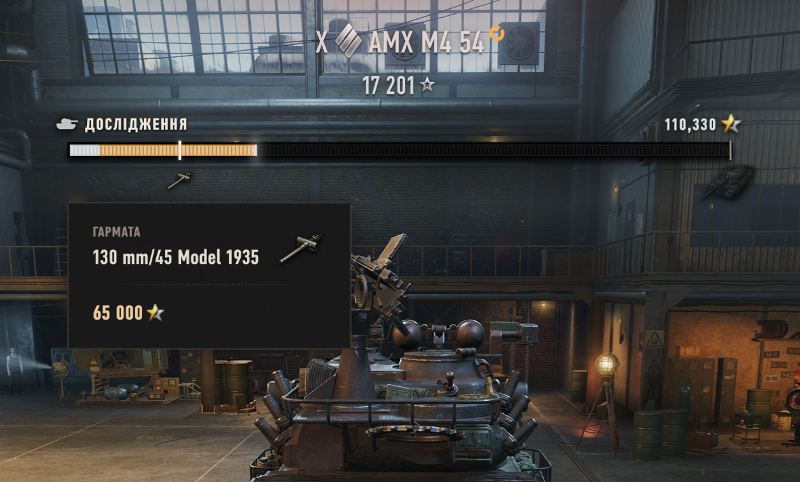

## Що показує

- **Дослідження в дереві розвитку** — досліджені модулі та наступна техніка для відкриття.
- **Польові модифікації** — рівні вдосконалень після завершення прокачування.
- **Елітні рівні (престиж)** — поточний прогрес за грейдами після досягнення елітності.
- **Ексклюзивні нагороди XI рівня** — дорожня карта нагород для техніки XI рівня.
- **Дерево навичок XI рівня** — скільки вдосконалень дерева навичок відкрито із загальної кількості, а також наступні заблоковані вдосконалення на крок вперед, з'єднані з відкритою навичкою, на якій вони базуються.
- **Потенційний XI рівень** — опційна проекція для техніки X рівня, яка не має власного XI рівня: показує накопичений досвід відносно вартості відкриття XI рівня.
- **Повністю пройдено** — золота смуга, коли вже нічого досліджувати, вдосконалювати чи відкривати: перелічує кожен завершений тип прогресу з підсумковою вартістю в досвіді. Підказка кожного типу деталізує, що саме завершено і скільки це коштувало: досліджені елементи, кожен рівень Польових модифікацій, фінальне вдосконалення дерева навичок і кожну ексклюзивну нагороду з рівнем, на якому вона відкривається. На техніці XI рівня в заголовку показано той самий лічильник навичок, що й у смузі дерева навичок XI рівня.

**Натисніть на смугу**, щоб досліджувати модулі, відкрити наступну техніку або
застосувати вдосконалення XI рівня прямо з Ангара. **Наведіть** курсор на позначку
чи іконку, щоб побачити підказку.

### Кожен тип прогресу

**Польові модифікації** — рівні вдосконалень після завершення прокачування:

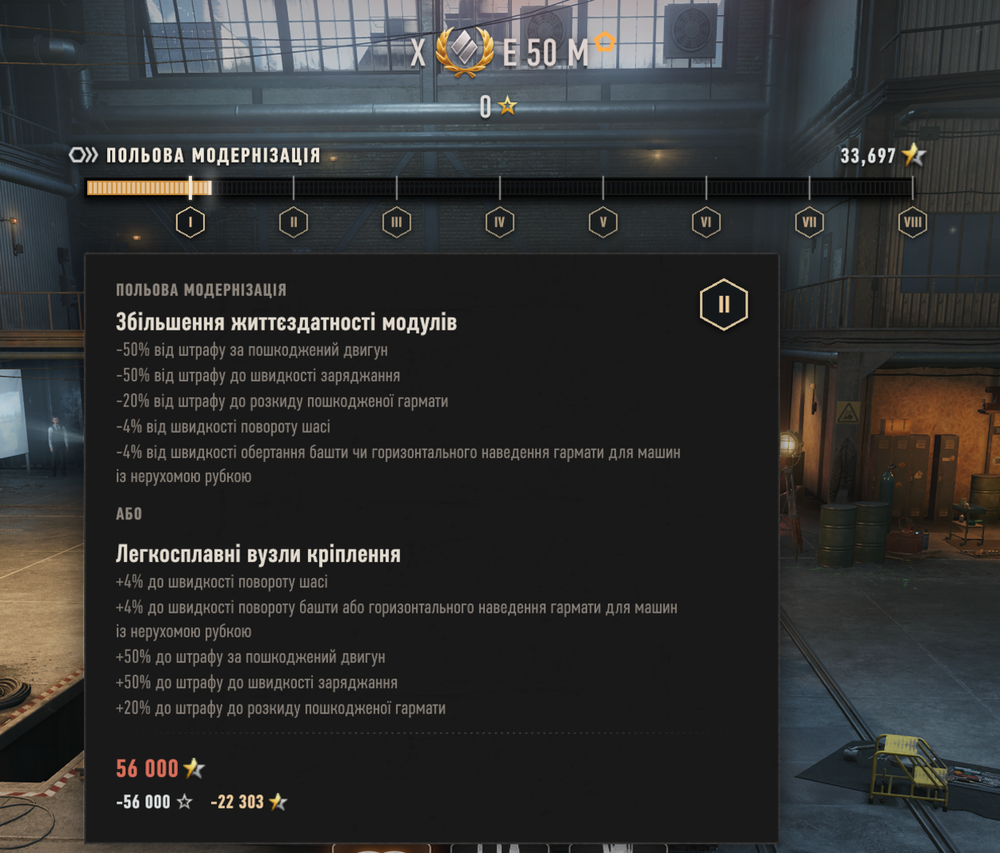

**Елітні рівні (престиж)** — поточний прогрес за грейдами:

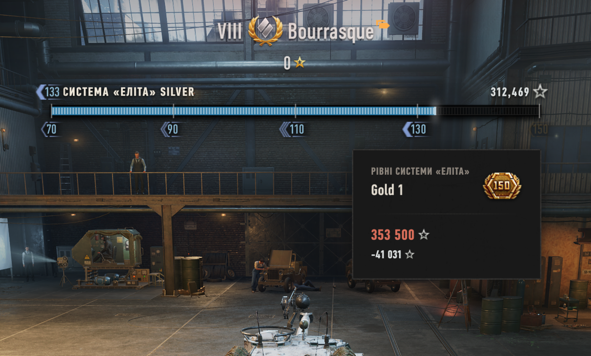

**Ексклюзивні нагороди XI рівня** — дорожня карта нагород:

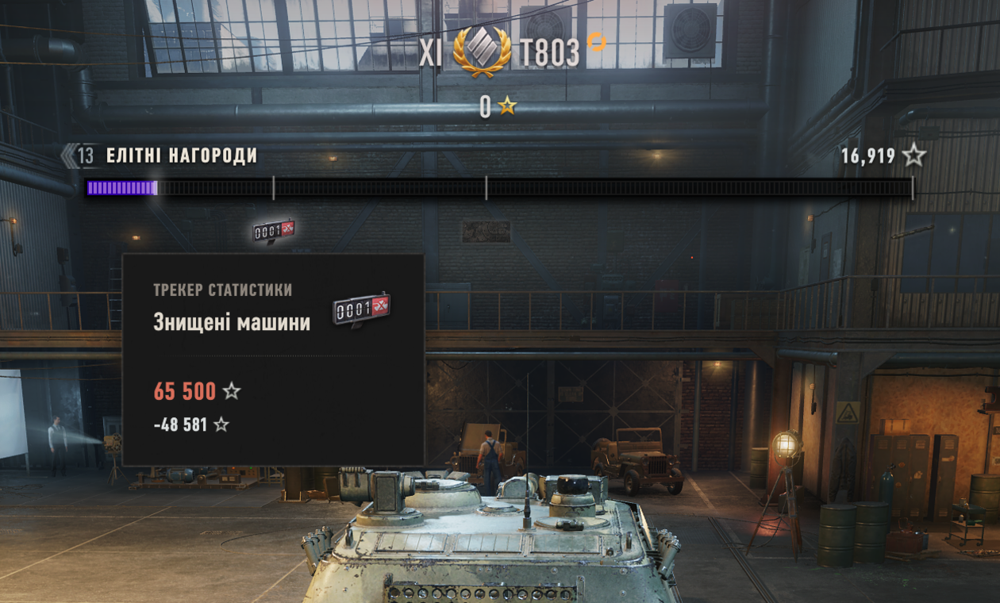

**Дерево навичок XI рівня** — відкриті вдосконалення із загальної кількості на техніці XI рівня, з наступними заблокованими вдосконаленнями попереду, з'єднаними з відкритою навичкою, на якій вони базуються:

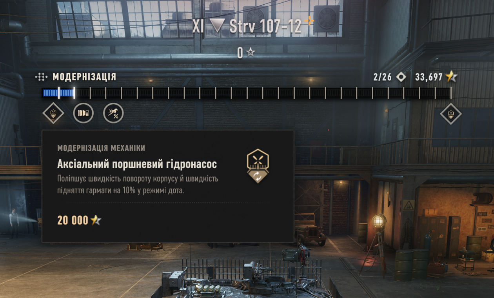

**Потенційний XI рівень** — опційна проекція для техніки X рівня без XI рівня: накопичений досвід відносно вартості відкриття (вимкнено за замовчуванням):

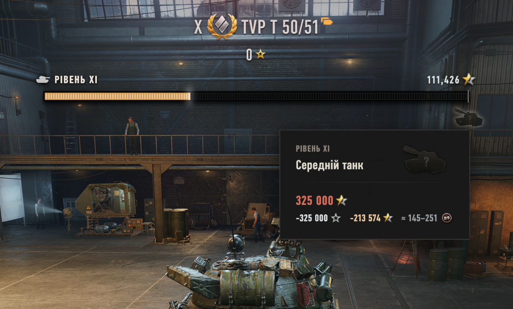

**Повністю пройдено** — золота смуга, коли вже нічого досліджувати, вдосконалювати чи відкривати:

## Сумісність

| Вимога | Деталі |
|--------|--------|
| **Гра** | World of Tanks **EU 2.4.0.2** (глобальний клієнт Wargaming). Зібрано й перевірено для цієї версії. |
| **Обов'язково** | **OpenWG GameFace** 1.1.6+ — встановіть першим, інакше смуга не з'явиться. З [wgmods.net](https://wgmods.net) або [gitlab.com/openwg/wot.gameface](https://gitlab.com/openwg/wot.gameface). |
| **Необов'язково** | **Aslain ModMenu** + **ModsList** — додають параметри мода у вікно «Список модифікацій» у грі. Інсталятор містить обидва; без них смуга просто показується скрізь без перемикачів. Більшість модпаків уже містять їх. |

## Завантаження та встановлення

**Найпростіше — інсталятор в один клік (Windows).** Завантажте найновіший
**`GarageProgressBar-Setup-<version>.exe`** зі сторінки
[**релізів на GitHub**](https://github.com/drizzer14/garage-progress-bar/releases)
і запустіть (спершу закрийте гру). Він знаходить папку World of Tanks, встановлює мод
у `mods\<version>\` і додає **OpenWG GameFace**, **Aslain ModMenu** та **ModsList**,
якщо їх ще немає. Під час кожного запуску він також перевіряє GitHub і пропонує завантажити
найновіший інсталятор, тож збережена копія залишається актуальною.

**Встановлення вручну.** Візьміть `com.14th_ua.garageprogressbar_<version>.wotmod` з
тієї ж сторінки релізів і дотримуйтесь **[`INSTALL.md`](./INSTALL.md)** — там описано
ручне копіювання, перевірку роботи, усунення несправностей і видалення.

## Налаштування

Зі встановленим **Aslain ModMenu** параметри мода з'являються у вікні **Список
модифікацій**, яке додає Aslain ModMenu. Без нього смуга просто показується скрізь зі
значеннями за замовчуванням і без параметрів. Параметри згруповані в три категорії:

| Категорія | Параметр | За замовчуванням | Що робить |
| --- | --- | --- | --- |
| **Режими** | **Дослідження** | Увімк. | Показує смугу на техніці, що досліджує модулі та наступників у дереві. |
| | **Польові модифікації** | Увімк. | Показує смугу на техніці, що проходить польові модифікації. |
| | **XI рівень** | Вимк. | Опційно — показує проекцію потенційного XI рівня. |
| | **Вдосконалення** | Увімк. | Показує смугу на техніці XI рівня, що витрачає досвід у дереві навичок. |
| | **Елітні нагороди** | Увімк. | Показує смугу, поки є нагорода елітного рівня, яку ще не відкрито. |
| | **Елітна система** | Увімк. | Показує смугу для прогресу елітних рівнів (престижу). |
| | **Повністю пройдено** | Увімк. | Лишає смугу на техніці, де вже нічого досліджувати, вдосконалювати чи відкривати. Зніміть позначку, щоб ховати її після повного проходження. |
| | **Дозволити резервний режим** | Вимк. | Якщо увімкнено, смуга пропускає вимкнений режим і показує наступний доступний режим за порядком пріоритету, замість того щоб ховатися. |
| **Форматування** | **Ігнорувати вільний досвід** | Вимк. | Враховує лише бойовий досвід, зароблений на кожній техніці, виключаючи загальний вільний досвід зі смуги, підсумків і підказок. |
| | **Показувати прогрес у %** | Вимк. | Додає відсоток прогресу перед лічильником досвіду. |
| | **Режим прогресу** | Поточний | Що показує лічильник досвіду — лише наявний досвід чи «Поточний / Потрібно». |
| **Розташування** | **Масштаб** | За замовчуванням | «Великий» приблизно вдвічі збільшує ширину смуги та збільшує її текст, іконки й підказку. |
| | **Позиція** | Автоматично | Ctrl+перетягніть смугу в Ангарі, щоб перемістити її, або введіть точні екранні координати в пікселях (**По горизонталі (центр X)** / **По вертикалі (верх Y)**). Скидання мода в панелі повертає її в автоматичне положення. Ангар режиму «Штурм» (Onslaught) зберігає власну позицію, окремо від звичайного Ангара. |
| | **Позиція по горизонталі (Onslaught)** | Автоматично | Центр смуги по X в ангарі режиму «Штурм», у пікселях. 0 означає успадкування звичайної позиції по горизонталі. |
| | **Позиція по вертикалі (Onslaught)** | Автоматично | Верх смуги по Y в ангарі режиму «Штурм», у пікселях. 0 означає успадкування звичайної позиції по вертикалі. |

Якщо вимкнути всі перемикачі в категорії **Режими**, смуга не показуватиметься на жодній техніці.

## Примітки та обмеження

- **Подієві та спеціальні ангари** (наприклад 7×7) не надають панель, до якої
  кріпиться смуга, тож там вона не з'явиться. У звичайному Ангарі вона повертається.
- **Перемістити смугу** можна, утримуючи **Ctrl** і перетягуючи її в Ангарі, або задавши
  точні координати в пікселях у панелі налаштувань; скидання мода в панелі повертає її в
  автоматичне положення.
- **Після оновлення гри** перемістіть `.wotmod` у нову папку `mods\<версія>\`. Нова
  версія клієнта може потребувати перезібраного мода — перевіряйте сторінку релізів.
- **Клік по позначці завершеного модуля техдерева** одразу купує та встановлює його
  (рідна дія гри «Купити й встановити»), а не лише відкриває екран досліджень, як для
  інших типів прогресу — при цьому все одно спрацьовують рідні діалоги гри
  щодо витрат/підтвердження, тож покупку не можна обійти чи приховати, але це зручність,
  якої немає в базовому інтерфейсі гри.

## Конфлікти з модами

- **Моди «старого інтерфейсу» / застарілого ангара** — наприклад *Legacy Interface UI*
  (`renovo.legacyhangar`). Вони замінюють сучасний Ангар інтерфейсом до версії 2.0.
  Смуга побудована навколо сучасного інтерфейсу Ангара — кріпиться до його панелей і
  оформлена під його рідні смуги прогресу — тож вона не з'явиться, поки активний ангар
  старого стилю. Поверніться до стандартного інтерфейсу Ангара, щоб її побачити.

## Модпаки та ліцензія

Вільно використовувати, поширювати та включати в модпаки, доки це залишається
безкоштовним і зазначає автора (**14th_ua**) з посиланням на цей репозиторій — див.
[`LICENSE.md`](./LICENSE.md). Для модпаків додавайте лише `.wotmod` і вкажіть OpenWG
GameFace як обов'язкову залежність; не вкладайте GameFace чи Aslain ModMenu самі.

## Розробка

Збірка, розгортання, тести та структура репозиторію описані в
[`CONTRIBUTING.md`](./CONTRIBUTING.md) (а цикл розробки — у
[`tools/dev/README.md`](./tools/dev/README.md)).
